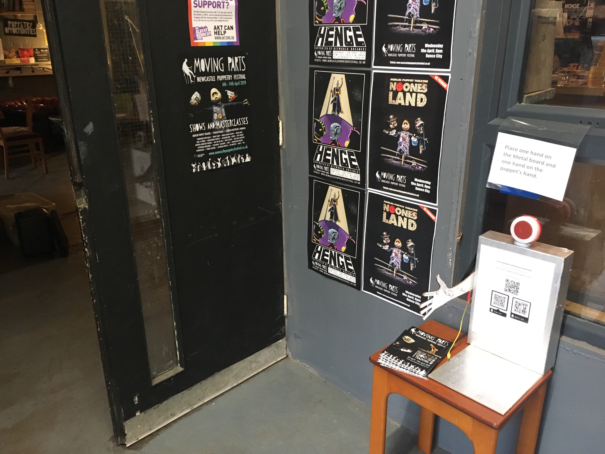
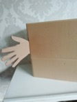
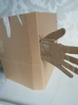
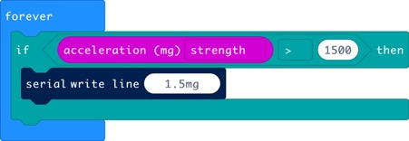
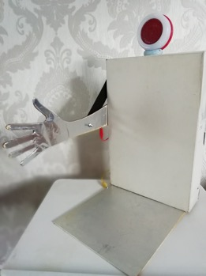
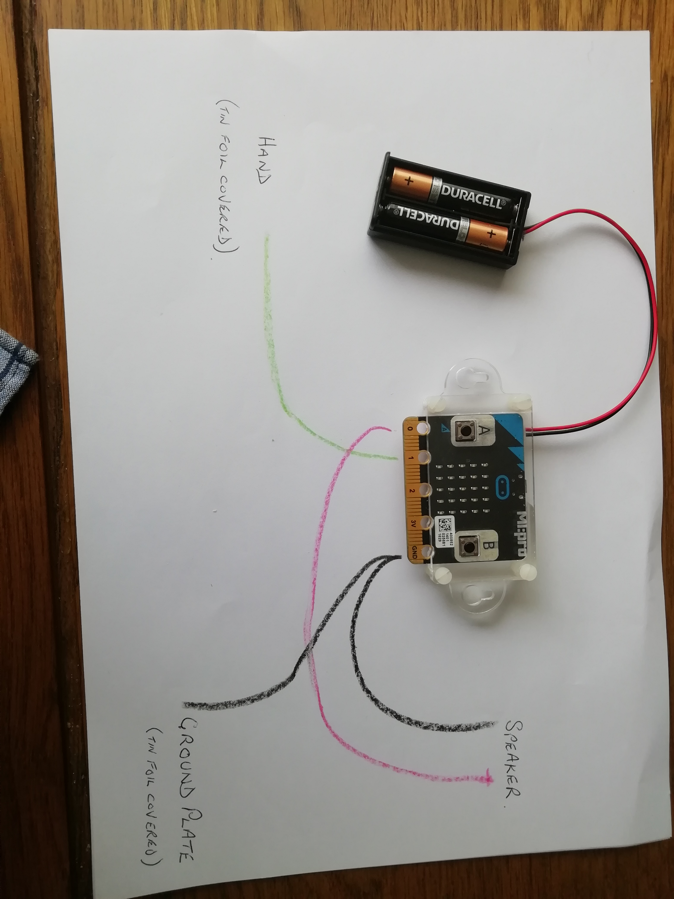

# **newcastle puppetry festival hand automaton exhibit**
A automaton which has been on display as part of the Newcastle puppetry festival 2019, For the duration of  the Newcastle puppetry festival Between 6th April and 14th April. It was used to welcome guests to the festival. Below is a picture of the automaton on display.

 # **How I made my puppet for the Newcastle Puppetry Festival**
I started out with a prototype which was A cardboard box with A slit in it, with a hand made out of cardboard like this. 
 

It had a BBC micro:bit with code written in Microsoft make code to Record how much force is exerted on the hand to shake it for a proof of concept.

Following on from that prototype.  At the next coderdojo Gateshead session. I moved onto a wooden model of a hand, at that session I realised that people who shake the hand would  exert different forces onto the hand when they shake it, so I found a simpler solution of detecting when a circuit is complete  and I had also decided I wanted it to speak, so I moved the project in to the programming language python for the BBC micro:bit and I moved it into a different housing unit, a converted box-file, with a Hole to screw the hand onto and a piece of elastic to stop the hand from falling down and a speaker with lights which I got free with three cans of Pringles attached on the top with some sticky tack which look like this.

# **wiring diagram**

Please see the image below for the wiring diagram.

# **acknowledgements**

Thank you to the following people for helping me with my project for the Newcastle Puppetry Festival.

* 	Everybody at coderdojo Gateshead for their help, mentoring and support.

* Dani from coderdojo Gateshead and Matt from the Newcastle Puppetry Festival for giving me the opportunity to design an automaton for the Newcastle Puppetry Festival.

* Megan from Newcastle University for letting me loan a BBC micro bit for the duration of the festival and beforehand to build my project. 

* Jacqui from Gateshead library Digital Team for looking after my project at the library once I had finished it and then passing it on to Matt to display at the festival.

* My Family for helping me come up with the final housing unit for my project and painting it silver. 

                                                                                                                                                                                                                                    